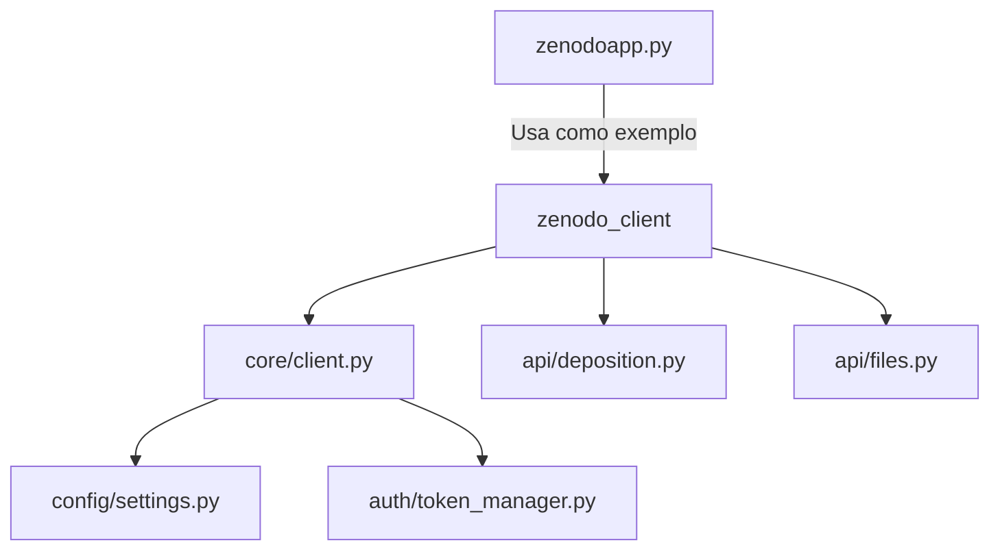

# Zenodo Automatic Upload Client

Este projeto evoluiu de um script Python monolítico (`zenodoapp.py`) para uma estrutura modular (`zenodo_client/`), proporcionando maior flexibilidade e manutenibilidade.

## Project Evolution

### Fase 1: Script Monolítico (zenodoapp.py)
- Implementação inicial com todas as funcionalidades básicas
- Interface CLI para uploads simples
- Funcional até hoje como ferramenta de referência

### Fase 2: Pacote Modular (zenodo_client/)
- Estrutura projetada em `projeto_estrutura.md`
- Componentes separados por responsabilidade:
  - `core/`: Lógica central do cliente
  - `api/`: Endpoints específicos da API Zenodo
  - `config/`: Gerenciamento de configurações
  - `auth/`: Autenticação e tokens
- Permite integração em outros projetos Python

### Relação entre Componentes


## Funcionalidades

### Via Script Monolítico (`zenodoapp.py`)
*   Criar novos depósitos (rascunhos) no Zenodo
*   Fazer upload de arquivos para um depósito
*   Adicionar metadados (título, autores, descrição, tipo, etc.)
*   Publicar depósitos para obter DOI permanente
*   Mover arquivos processados para `uploaded_files/`
*   Modos de operação: 
    - Interativo (padrão)
    - Linha de comando (CLI)
    - Monitoramento básico de pasta (`--monitor`)

### Via Pacote Modular (`zenodo_client/`)
- Todas as funcionalidades do script monolítico
- Implementação modular para reutilização
- Base para extensões futuras (ex: filas de jobs)
- Interface mais consistente para integrações

## Pré-requisitos

*   Python 3.6+ instalado
*   Conta no Zenodo (ou Zenodo Sandbox para testes)
*   Chave de API com escopos `deposit:write` e `deposit:actions`
  - [Guia de configuração](referência_api.md)

## Configuração

### Configuração da Chave de API
Configure sua chave na variável de ambiente `ZENODO_TOKEN`:

```bash
# Configuração temporária
export ZENODO_TOKEN="SEU_TOKEN_DE_ACESSO_AQUI"

# Configuração permanente
echo 'export ZENODO_TOKEN="SEU_TOKEN_DE_ACESSO_AQUI"' >> ~/.bashrc
source ~/.bashrc
```

### Instalação de Dependências
```bash
cd /media/peixoto/stuff/zenodo_automatic
python3 -m venv venv
source venv/bin/activate
pip install -r requirements.txt
```

## Uso

### Via Script Monolítico
```bash
# Modo interativo
python zenodoapp.py

# Modo CLI
python zenodoapp.py \
  --file "caminho/arquivo.pdf" \
  --title "Título" \
  --desc "Descrição" \
  --creator "Autor 1" \
  --creator "Autor 2" \
  --type "publication"

# Modo monitoramento
python zenodoapp.py --monitor
```

### Via Pacote Modular (Exemplo)
```python
from zenodo_client import ZenodoClient

client = ZenodoClient()
deposition = client.create_deposition(title="Meu Depósito")
client.upload_file(deposition.id, "caminho/arquivo.pdf")
client.publish_deposition(deposition.id)
```

## Estrutura do Projeto

```
zenodo_automatic/
├── .env
├── .gitignore
├── README.md
├── guia_interativo_integra_zenodo.html
├── projeto_estrutura.md
├── referência_api.md
├── requirements.txt
├── test_zenodo_api.py
├── upload_queue/
├── uploaded_files/
│   └── exemplo.pdf
├── venv/
├── zenodo_client/       # Pacote modular
│   ├── api/
│   │   ├── deposition.py
│   │   └── files.py
│   ├── auth/
│   │   └── __init__.py
│   ├── config/
│   │   └── settings.py
│   ├── core/
│   │   └── client.py
│   └── ...             # Outros módulos
├── zenodo_metadata_prompt.md
└── zenodoapp.py         # Script monolítico original
```

## Roadmap

### Melhorias no Script Monolítico
- [ ] Implementar monitoramento contínuo com `watchdog`
- [ ] Melhorar tratamento de erros
- [ ] Expandir opções de metadados
- [ ] Adicionar versionamento de registros

### Desenvolvimento do Pacote Modular
- [x] Criação de depósitos (`api/deposition.py`)
- [x] Atualização de metadados (`api/deposition.py`)
- [x] Listagem de arquivos (`api/files.py`)
- [ ] Upload de arquivos (`api/files.py`)
- [ ] Cliente base com retry/backoff (`core/client.py`)
- [ ] Gerenciamento de tokens (`auth/`)
- [ ] Endpoints de metadados (`api/metadata.py`)
- [ ] Testes unitários (`tests/`)
- [ ] Exemplos de uso (`scripts/`)


